# GPG & SSH Key Management + Hash Cracking Tasks

**Name:** Muhammad Aabas Bin Md Suji  
**Email:** maabas.mdsuji@student.gmi.edu.my  
**Student ID:** NWS23010046  

## 📌 Overview

This repository contains the results and evidence of five key tasks involving GPG key management, file encryption/decryption, digital signing, passwordless SSH configuration, and hash cracking. These tasks were carried out as part of the cybersecurity learning module.

---

## ✅ Task 1: Generate GPG Key Pair

### Create RSA key pair 

Generate key with `gpg`.

```bash
gpg --full-generate-key
```

- `--full-generate-key`: This tells GPG to guide you through a detailed key creation process.

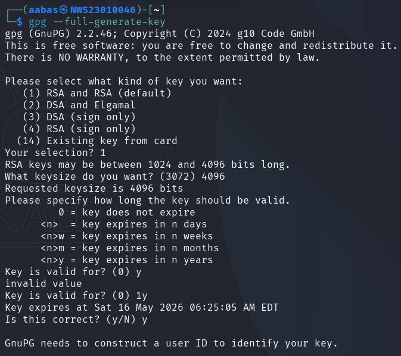

- **Key Type:** RSA & RSA  
- **Key Size:** 4096 bits  
- **Expiry:** 1 year

#### Name:

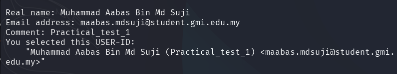

**After create a key, `gpg` will ask us to put a password for the key.*

---

### Result

List key in `gpg`.

```bash
gpg --list-keys
```

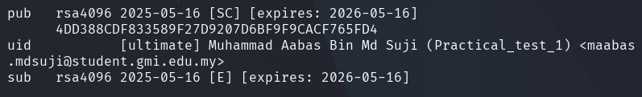

---

## ✅ Task 2: Encrypt and Decrypt a File


### Create plaintext

```bash
echo "This file was encrypted by Aabas (NWS23010046)" > plaintext.txt
```

---

### Encrypt plaintext

```bash
gpg --encrypt --recipient maabas.mdsuji@student.gmi.edu.my plaintext.txt
```

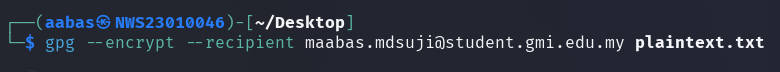

- `--recipient` : gpg will find the key that has binded with the email like key id.

*after encrypt.

```bash
gpg: encrypted with 4096-bit RSA key, ID BA006ABD5FF03EB9, created 2025-05-16
      "Muhammad Aabas Bin Md Suji (Practical_test_1) <maabas.mdsuji@student.gmi.edu.my>"
```

---

### Decrypt ciphertext

```bash
gpg --output decrypted.txt --decrypt plaintext.txt.gpg
```


- `--outout` : make a output from decryption.

Then we need to enter the password.

---

### Result

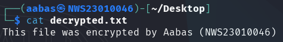

---

## ✅ Task 3: Sign and Verify a Message

### Create file 

```bash
echo "Crypto_practical_test_1" > signed_message.txt
```

---

### Assign the message

I use this command because in my `gpg`, i have more than 3 key so we need to specific wich key we want to use.

```bash
gpg --local-user "Aabas <maabas.mdsuji@student.gmi.edu.my>" --clearsign signed_message.txt
```

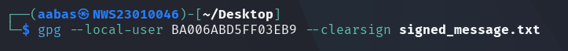

- `--local-user` : gpg will find the key that has been bind with <name> and <email>.

- `--clearsign` : assign message without create a digital signature output.

---

### Verify the message

```bash
gpg --local-user "Aabas <maabas.mdsuji@student.gmi.edu.my>" --verify signed_message.txt
```

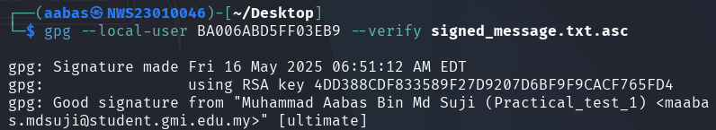

- `--verify` : verify message with digital signature.

---

## ✅ Task 4: Configure Passwordless SSH Authentication

1. Generate key from power shell windows.

```bash
ssh-keygen -C "Aabas-NWS23010046"
```


2. Copy your public key and paste `/.ssh/authorized_keys (Kali)`.

```bash
type C:\Users\Aabas\.ssh\id_rsa.pub
```


](screenshot/Task_4/pub_key.png)

3. Set permission `/.ssh/authorized_keys` in Kali to be owned by user that we want to login. Example (Aabas).


4. Login ssh from power shell to kali without password.

```bash
ssh aabas@192.168.157.145
```

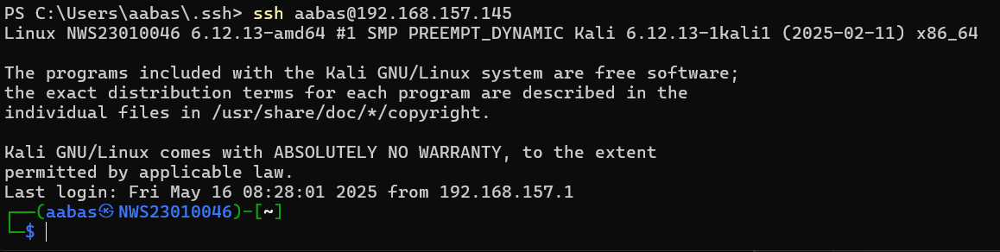


5. Execute command `whoami` with ssh.

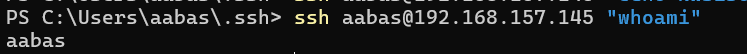


6. create file with ssh.

```bash
PS C:\Users\aabas\.ssh> ssh aabas@192.168.157.145 "echo NWS23010046 > Aabas.txt"
```

---

### Result

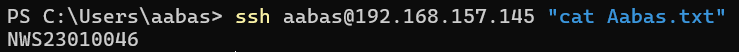

---

## ✅ Task 5: Hash Cracking Challenge

Objective: Crack provided hashes.

- `SnZlcmV4IEF2IEpmcmNyZSBFeiBCcnJl`
- `7b77ca1e2b3e7228a82ecbc7ca0e6b52`
- `e583cee9ab9d7626c970fd6e9938fcb2d06fbbd12f1c1a3c6902a215808c825c`

---

### Hash 1 :

Im using CyberChef & Decode here.

1. Identify the hash


2. decrypt with cyber chef.

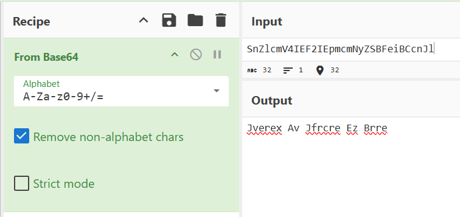


3. Indentify again and found out the output is in Rot 9.

*Result
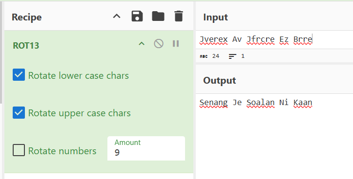

---

