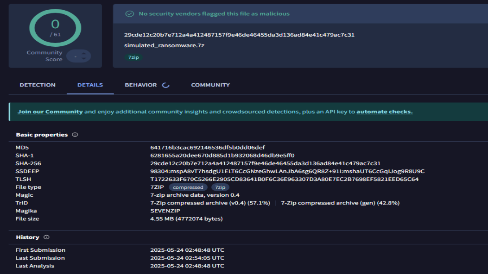
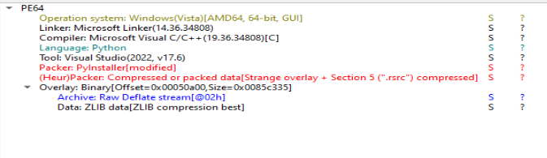
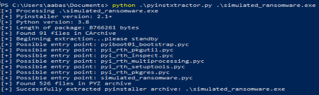

# 🔬 Malware Analysis Report – Python-based Executable with AES Encryption

Name : Muhammad Aabas Bin Md Suji

# 📌 Scenario

## 🔐 Ransomware is a malicious real-world application of cryptography. In this exercise, you will act as a cryptography and malware reverse engineer, tasked with analyzing a suspicious binary that simulates ransomware behavior. Your job is to analyze, extract, and break the cryptography used in this malware, and then write a decryption script to recover the victim's files, and save the world.

---
# ⚠️ Important Notes

- This is NOT real ransomware. It is a simulated binary created for educational purposes only.
- However, it mimics real cryptographic behavior used in ransomware.
- Even though it's safe, please use secure practices:
- Analyze it in a dedicated VM or sandbox environment.
- Avoid running unknown ".exe" directly on your host OS.

---

## 🧰 Tools Used

See the guides to install the tools [here.](requirement/README.md)

| Tool            | Purpose                                   |
|-----------------|-------------------------------------------|
| `Python 3.8`      | Required version for compatibility        |
| `DIE (Detect It Easy)` | Determine how the malware was compiled |
| `pyinstxtractor`  | Extract `.pyc` files from PyInstaller `.exe` |
| `uncompyle6`      | Decompile `.pyc` files to readable `.py`  |
| `VS Code `        | Code editor for analysis                  |

---

## 📁 Initial File

- `Download File`: simulated_ransomware.7z
- `Password`: semogaberjaya
- `SHA-256 Hash`: 29cde12c20b7e712a4a412487157f9e46de46455da3d136ad84e41c479ac7c31



>Check with virus total
---

## 🔍 Step-by-Step Analysis

---

### 🔎 1. Analysis with VirusTotal

Open `VirusTotal` in hte browser then analys the file.


>Check with virus total

- We need to identify if the file is save or not.

---

### 🔎 2. Static Analysis with DIE

Open `DIE` and upload the file to see the structure.

> Use DIE to identify how the `.exe` file was packed or compiled.



Result:
- Language : python

**Why this is important:**
Knowing that PyInstaller was used helps us decide the correct extractor tool (`pyinstxtractor`) to use.

**Possible Errors:**
- ❌ *Unknown compiler* → The file may be obfuscated or not made with PyInstaller.
- ✅ *Solution:* Try running `strings malware.exe | findstr PyInstaller` to confirm manually.

---

### 📦 3. Extract with pyinstxtractor

**Purpose:**  
Extract the compiled Python bytecode files from the `.exe`.

Command:

```bash
python pyinstxtractor.py simulated_ransomware.exe
```

- we let `pyinstxtractor.py` to extract `simulated_ransomware.exe`



**Expected Output:**

A folder named `malware.exe_extracted/` will be created.
Inside it: `malware.pyc`, possibly other `.pyc` files.

**Why this is important:**
We need .pyc files to decompile and view the original code logic.

---

### 🔓 4. Decompile .pyc to .py

**Disclamer, start from here i use my own windows because my windows 10 need to troubleshoot with corrupted pip so i cant install compyle6 ;(.*

Convert `.pyc` files back into readable `.py` source code.

```bash
uncompyle6 -o . simulated_ransomware.pyc > ransomware.py
```

- uncompyle6 output will be save in `ransomware.py`

Reading the Python source helps us understand the malware’s behavior and find encryption logic.

---

## 🧠 Code Analysis

#### 🔐 Identified AES Encryption Code:

Identify how AES was used and what values (key, IV, ciphertext) are involved.

ransomware.py [source code.](ransomware.py)

```python
from Crypto.Cipher import AES
import os
from hashlib import sha256
KEY_SUFFIX = "RahsiaLagi"
KEY_STR = f"Bukan{KEY_SUFFIX}"
KEY = sha256(KEY_STR.encode()).digest()[None[:16]]

def pad(data):
    pad_len = 16 - len(data) % 16
    return data + bytes([pad_len]) * pad_len


def encrypt_file(filepath):
    with open(filepath, "rb") as f:
        plaintext = f.read()
    padded = pad(plaintext)
    cipher = AES.new(KEY, AES.MODE_ECB)
    ciphertext = cipher.encrypt(padded)
    with open(filepath + ".enc", "wb") as f:
        f.write(ciphertext)
    os.remove(filepath)


if __name__ == "__main__":
    folder = "locked_files/"
    os.makedirs(folder, exist_ok=True)
    sample_files = [
     "maklumat1.txt", "maklumat2.txt", "maklumat3.txt"]
    contents = [
     "Assalamualaikum semua, pelajar kursus Cryptography semester 5.\nKeselamatan siber bergantung kepada kebijaksanaan anda dalam memahami kriptografi.\nGunakan ilmu ini untuk melindungi data, sistem, dan masa depan teknologi.\nJadilah perisai digital yang berintegriti dan berkemahiran.",
     "Setiap algoritma yang anda pelajari hari ini adalah benteng pertahanan esok.\nKuasa penyulitan (encryption) bukan hanya tentang kod, tetapi amanah dalam menjaga maklumat.\nTeruskan usaha, dunia digital menanti kepakaran anda!",
     "Semoga ilmu yang dipelajari menjadi manfaat kepada semua.\nGunakan kepakaran anda untuk kebaikan, bukan kemudaratan.\nSemoga berjaya di dunia dan akhirat!\n\nAdli, Lecturer Part Time, Feb-Mei 2025"]
    for name, content in zip(sample_files, contents):
        path = os.path.join(folder, name)
        with open(path, "w") as f:
            f.write(content)
        encrypt_file(path)

# okay decompiling .\simulated_ransomware.pyc
```

This gives us the information we need to write a decryption script.

- key : RahsiaLagi

---

## 🧬 Reverse Engineering Objective

The goal is to write a `decryption script` to get the `original plaintext`.

Let's tell chatgpt to make a decrypt code because im running out of time hehe.

#### Decryption Script:

```python
from Crypto.Cipher import AES
from hashlib import sha256
import os

# 1. Key setup
KEY_SUFFIX = "RahsiaLagi"
KEY_STR = f"Bukan{KEY_SUFFIX}"  # "BukanRahsiaLagi"
KEY = sha256(KEY_STR.encode()).digest()[:16]

# 2. Padding remover
def unpad(data):
    pad_len = data[-1]
    if pad_len < 1 or pad_len > 16:
        raise ValueError("Invalid padding length")
    return data[:-pad_len]

# 3. Decrypt function
def decrypt_file(filepath):
    with open(filepath, "rb") as f:
        ciphertext = f.read()
    
    cipher = AES.new(KEY, AES.MODE_ECB)
    padded_plaintext = cipher.decrypt(ciphertext)
    plaintext = unpad(padded_plaintext)

    # Output to new file
    output_path = output_file = filepath.replace(".txt.enc", ".txt")

    with open(output_path, "wb") as f:
        f.write(plaintext)
    print(f"[+] Decrypted: {output_path}")


# 4. Main process
if __name__ == "__main__":
    folder = r"<Your locked_files>"

    for filename in os.listdir(folder):
        if filename.endswith(".enc"):
            path = os.path.join(folder, filename)
            try:
                decrypt_file(path)
            except Exception as e:
                print(f"[-] Failed to decrypt {filename}: {e}")

if not os.path.exists(folder):
    print(f"[-] Folder '{folder}' not found!")
exit(1)

```

Here `folder = r"<Your locked_files>"`, I make a hardcode but to post in Git i dont show the directory cause of my privacy purpose :).

---

## 🧾 Result


---

## 🧠 Conclusion

- The malware used `AES CBC` encryption to obfuscate its payload
- Static + dynamic analysis allowed retrieval of the original message
- This task demonstrates basic reverse engineering and cryptography understanding
