# 🔐 Lab 1: Cryptographic Attacks — Brute Force and Traffic Analysis on Network Protocols

## 🎯 Objectives

- Understand how brute-force attacks work on common network services (FTP, Telnet, SSH).
- Practice using tools like Hydra for password attacks.
- Learn how to use Wireshark to analyze network traffic.
- Identify insecure protocols that transmit data in plaintext.
- Propose secure alternatives and mitigation strategies.

---

## 🧰 Setup

- **Hydra** & **Medusa** – for performing brute force attacks  
- **Wireshark** – for capturing and analyzing network traffic  
- **Kali Linux** – used as the attacker machine  
- **Metasploitable2** – vulnerable virtual machine  
- **FTP, Telnet, SSH** – services used for login and analysis
  
Kali Linux : 192.168.157.145
Metasploitable : 192.168.157.137

---

## 🔍 Service Discovery (Optional Enumeration Step)

Use Nmap to identify running services on the target:

```bash
nmap -sV -p 21,22,23,80 192.168.157.137
```
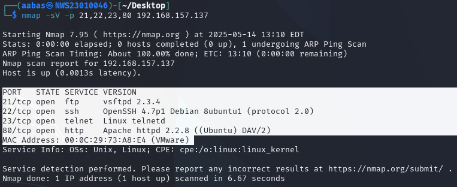

### Explanation:
- `-sV`: Version detection (shows service version like vsftpd, OpenSSH)
- `-p`: Specifies ports to scan (21 = FTP, 22 = SSH, 23 = Telnet, 80 = HTTP)
  
Result:  
- FTP running on port 21  
- Telnet on port 23  
- SSH on port 22
- HTTP on port 80

---

## Discover Venerable Username & Password

## 1. Enumeration of Usernames🥐

Prepare a list of potential usernames and passwords to use for brute-force attacks.

### 1.1 Create a text file for usernames:

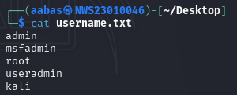

### 1.2 Create a text file for passwords:

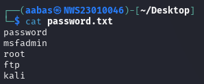

---

## 2. Brute Force Attacks🥖

### 2.1 FTP
- **Tool**: Medusa
- **Command**:

```bash
hydra -L usernames.txt -P passwords.txt ftp://192.168.154.133
```

### Explanation:
- `-h`: Target IP address.
- `-U`: Username wordlist.
- `-P`: Wordlist.
- `-M`: Service that we want to do.
- `-t`: boost brute-force speed.

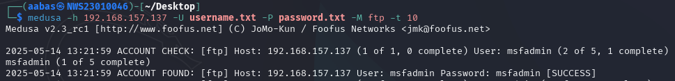

**Result**: Successful login found – `msfadmin:msfadmin`


---

### 2.2 Telnet
- **Tool**: Hydra
- **Command**:

```bash
hydra -l msfadmin -P passwords.txt telnet://192.168.157.137
```

### Explanation:
- `-l`: Specify a single username.
- `-P`: Load a list of passwords from a file.
- `telnet://`: Specifies the Telnet service and target IP.

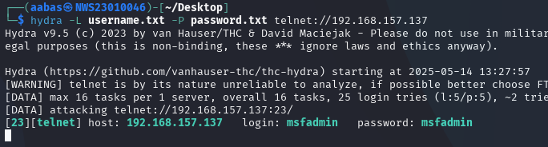


**Result**: Successful login – `msfadmin:msfadmin`


---

### 2.3 SSH
- **Tool**: Medusa
- **Command**:

```bash
medusa -h 192.168.157.137 -U usernames.txt -P passwords.txt -M ssh
```
### Explaination
- `-h`: Target host (your Metasploitable IP)
- `-U`: File containing usernames
- `-P`: 	File containing passwords
- `-M`: Module to use – in this case, ssh for brute-forcing SSH login
  
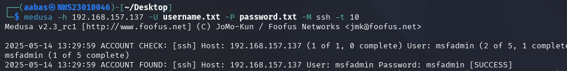

Results: ACCOUNT FOUND: [ssh] Host: 192.168.204.147 User: msfadmin Password: msfadmin [SUCCESS]

---

### 2.4 HTTP

#### Step 1

Open Browser and put metasploitable2 ip address in the url.

```bash
192.168.157.137
```

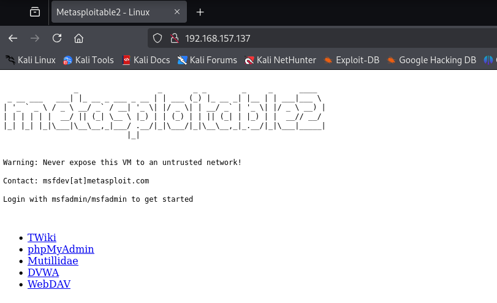

after that, open dvwa and login then go to brute-force page.

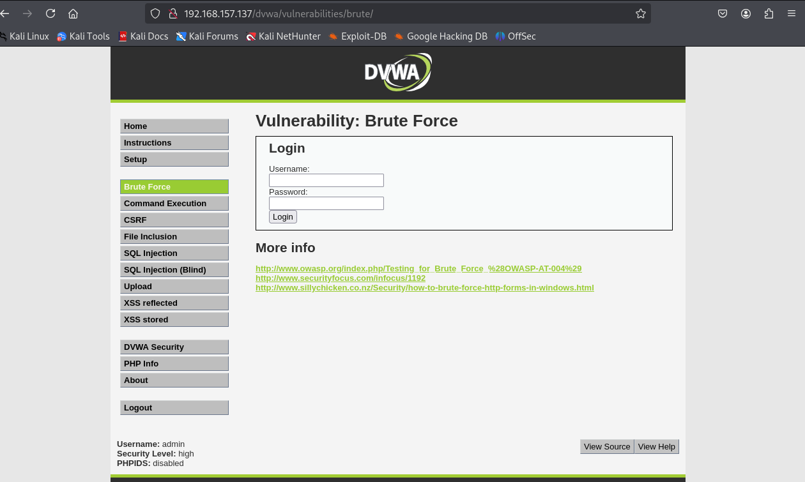

---

### Step 2

open burpe suite and go to proxy then on the intercept.

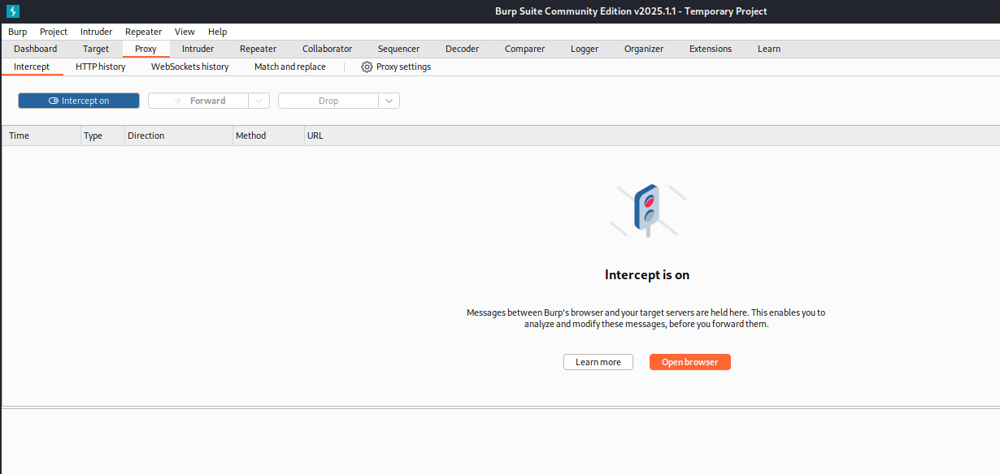

---

### Step 3

login the dvwa with the wrong password then burpe suite will intercept the request from website.

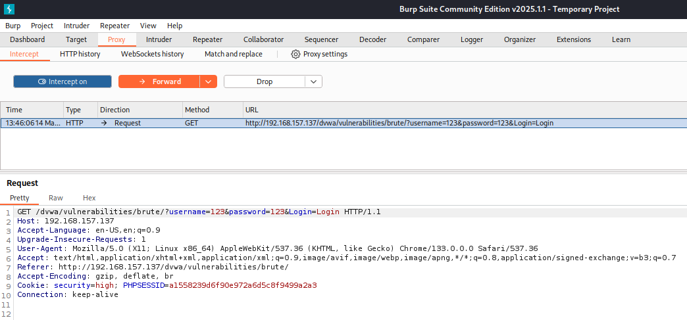

### Step 4

right click the request then send the request to introder.

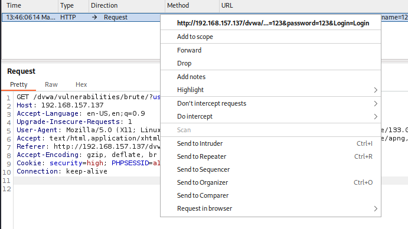

### Step 5

Here, highlight the username and password that we put and click add. After that change attack type to cluster bomb attack.

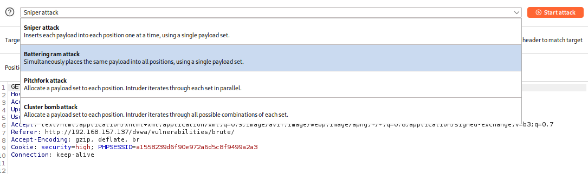

### Step 6

In payload session, put wordlist for password and username.

Username :

](screenshot/username_payload.png)

Password :

](screenshot/password_payload.png)

After that click `Start Attack`.

---

### Result :

In the result, we can verify the longest length is the real username and password.

](screenshot/result.png)

](screenshot/open_result.png)

Now copy the request and over write the previous request in the proxy then click `forward`.You will successful login to the dvwa brute force form.

](screenshot/success.png)

**Welcome to the password protected area admin*

