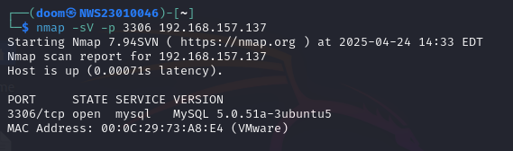
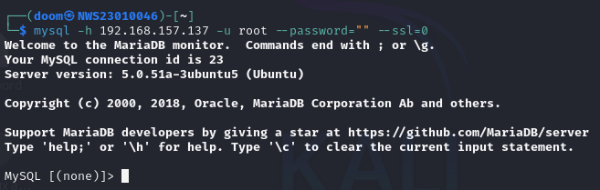
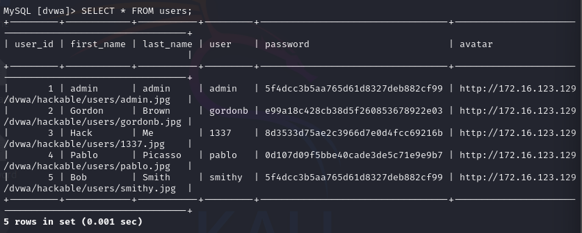
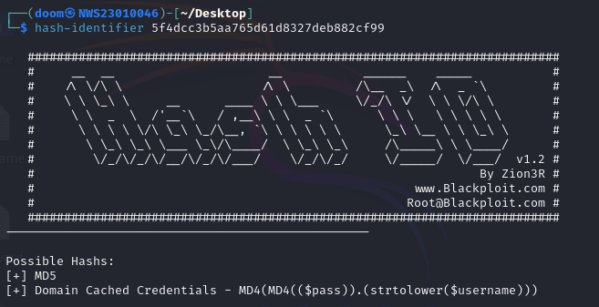
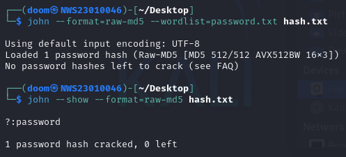
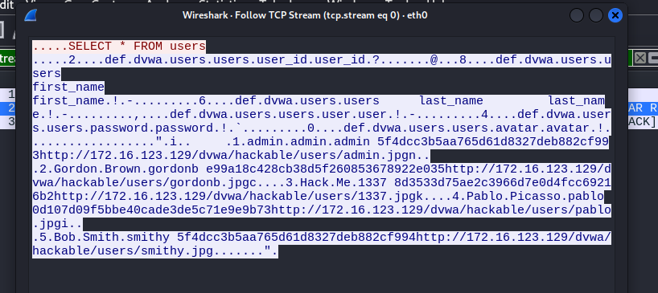

# 🔐 Lab 2: Cryptographic Attacks – Cracking Weak Password Hashes & Exploiting Poor Authentication in Databases

**👨‍💻 Author**: Raja Muhammad Haiqal Shah Bin Raja Muzairil Shah  
**📅 Date**: 25 April 2025  
**⏳ Time Allocation**: 3 Hours  
**📝 Total Marks**: 15  
**🧩 Lab Type**: Hands-On + Report + Demo/Debrief  

---

## 🧠 A. Lab Objectives

1. Identify and exploit cryptographic weaknesses in database authentication and password storage.
2. Perform offline hash cracking after discovering password hashes in a vulnerable database.
3. Investigate real-world cryptographic failures and propose secure solutions.
4. Document findings clearly in GitHub (Markdown) and present a short demo/debrief.

---

## 🛠️ Tools Used

- `Kali Linux` (OS)
- `nmap` (Service enumeration)  
- `mysql-client` (Database access)  
- `hashid` / `hash-identifier` (Hash detection)  
- `hashcat` / `john` (Hash cracking)  
- `wireshark` (Traffic analysis – optional)

---

## 🌐 IP Addresses

- **Attacker**: `192.168.157.142`  
- **Victim**: `192.168.157.137`  

---

## 🧩 B. Lab Tasks

### 1. 🔍 Service Enumeration and Initial Access

**Command Used:**

```bash
nmap -sV -p 3306 192.168.157.137 > nmap.txt

```


- Identified that **MySQL** was running on port **3306**.

**Attempting Connection:**

```bash
mysql -h 192.168.157.137 -u root --password=""
```

**Error Encountered:**
```vbnet
ERROR 2026 (HY000): TLS/SSL error: wrong version number
```
### 🔍 What's actually going wrong?
By default, modern MySQL clients try to connect using SSL/TLS.
But:
- If the server is old (e.g. MySQL 5.5 or earlier), it might not support TLS properly.
- If SSL is not configured on the server, the client handshake will fail.
- If the client expects TLS 1.2+, and the server doesn't support it, you get a mismatch.

**Solution:**

```bash
mysql -h 192.168.157.137 -u root --password="" --ssl=0
```



✅ **Resolved**: TLS version mismatch between MySQL client and server.

> **Note**:  
> MySQL versions prior to 5.7.11 do not support `--ssl-mode`. Use `--ssl=0` to disable SSL.

---

### 2. 🧑‍💻 Enumeration of Users and Authentication Weaknesses

```sql
USE dvwa;
SHOW TABLES;
```

**Expected Output:**


**Querying user data:**

```sql
SELECT * FROM users;
```

- Found usernames and MD5 password hashes.
- Selected user admin for cracking.



**Saved hash to file:**

```bash
echo "5f4dcc3b5aa765d61d8327deb882cf99" > hash.txt
```

> ⚠️ **Reflection Question**:  
> Is accessing a database with no password a cryptographic failure?  
> ✅ Absolutely — it violates basic secure authentication practices.

---

### 3. 🔍 Password Hash Discovery & Identification

Used `hash-identifier`:

```bash
hash-identifier 5f4dcc3b5aa765d61d8327deb882cf99
```

- Detected as **MD5** hash.



> ⚠️ **Reflection**:  
> Why is MD5 considered insecure? 
> - It’s fast and unsalted, making it highly vulnerable to rainbow tables and brute-force attacks.


---

### 4. 🧨 Offline Hash Cracking

Used `john the ripper` to perform brute-force on the MD5 hash:

### 🧠 John is picky about formats
John tries to guess the format from the structure of the hash. If it doesn’t recognize it, or the structure is too simple (like plain MD5), you must manually tell John what it is, using:

```bash
john --format=raw-md5 --wordlist=password.txt hash.txt

```

✅ **Result:**
```makefile
5f4dcc3b5aa765d61d8327deb882cf99:password
```



**Cracked Password**: `password`

> This is one of the most common weak passwords — easily guessable and widely used.

---

### 5. 🔐 Cryptographic Analysis & Mitigation

#### 🔎 Weakness Summary

| Area          | Issue                      |
|---------------|----------------------------|
| Authentication | Weak/missing passwords     |
| Hashing        | Unsalted MD5 hashes        |
| Transmission   | Unencrypted data in transit|


#### 🔧 Recommendations:

- **Authentication**: Enforce password complexity rules and use rate limiting (`fail2ban`, `CAPTCHA`).
- **Hashing**: Replace MD5 with bcrypt, scrypt, or Argon2.
- **Transmission**: Use **TLS/SSL** for all database connections.

#### 🕵️ Wireshark Observation:
Traffic captured showed unencrypted SQL queries and sensitive data in transit.

- run wireshark then open users from dvwa mysql table.


---

## ✅ Conclusion

This lab exercise demonstrated the serious risks posed by outdated cryptographic practices in modern systems. Weak credentials, insecure hashing algorithms, and lack of encrypted communication can all be exploited.

To secure such systems:
- Enforce strict password and authentication policies.
- Use modern, slow, and salted hashing algorithms.
- Encrypt all traffic between clients and servers.

🔒 **Legacy systems should always be reviewed for cryptographic flaws.**