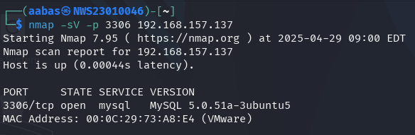
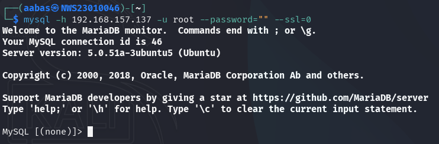
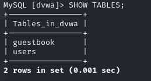
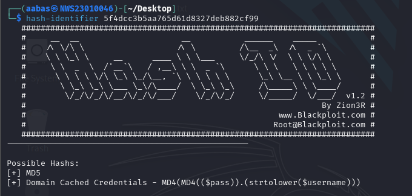
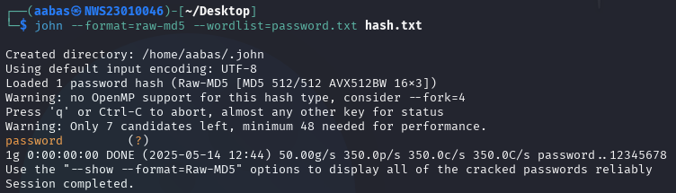

# 🧪 Lab 2: Cryptographic Attacks – Breaking Weak Hashes & Investigating Poor Database Authentication

**👨‍🏫 Student Name**: Muhammad Aabas Bin Md Suji  
**📅 Lab Date**: 25 April 2025  
**⏰ Duration**: Approximately 3 Hours  
**📊 Total Score**: 15 Marks  
**🧠 Lab Format**: Practical Exercise + Report Writing + Presentation/Debrief

---

## 🎯 A. Objectives

This lab is designed to help students:

1. Explore and exploit common cryptographic flaws in authentication systems.
2. Extract and crack password hashes stored insecurely in a vulnerable database.
3. Understand the impact of real-world cryptographic misconfigurations.
4. Present findings clearly through GitHub Markdown and a short live explanation/demo.

---

## 🔧 B. Tools and Resources

The following tools were used to complete this lab:

- `Kali Linux` – Main penetration testing environment  
- `nmap` – To identify open ports and services  
- `mysql-client` – For interacting with the MySQL server  
- `hashid` – To detect hash types  
- `john the ripper` – For cracking password hashes  
- `wireshark` – Optional tool to inspect network traffic for plaintext credentials (bonus)

---

## 🌐 IP Addresses

- **Attacker**: `192.168.157.142`  
- **Victim**: `192.168.157.137`  

---

## 🧩 B. Lab Tasks

### 1. 🔍 Service Enumeration and Initial Access

**Command Used:**

```bash
nmap -sV -p 3306 192.168.157.137 > nmap.txt

```


- Identified that **MySQL** was running on port **3306**.

**Attempting Connection:**

```bash
mysql -h 192.168.157.137 -u root --password=""
```

**Error Encountered:**
```vbnet
ERROR 2026 (HY000): TLS/SSL error: wrong version number
```

### 🔍 What's actually going wrong?
By default, modern MySQL clients try to connect using SSL/TLS.
But:

- If the server is old (e.g. MySQL 5.5 or earlier), it might not support TLS properly.
- If SSL is not configured on the server, the client handshake will fail.
- If the client expects TLS 1.2+, and the server doesn't support it, you get a mismatch.


**Solution:**

```bash
mysql -h 192.168.157.137 -u root --password="" --ssl=0
```
You need to tell the client not to use SSL. You already found the correct fix:



✅ **Resolved**: TLS version mismatch between MySQL client and server.

> **Note**:  
> The `--ssl=0` option disables **SSL** completely, which matches what the server expects — plain unencrypted connection.

---

### 2. 🧑‍💻 Enumeration of Users and Authentication Weaknesses

```sql
USE dvwa;
SHOW TABLES;
```

**Expected Output:**



**Querying user data:**

```sql
SELECT * FROM users;
```

- Found usernames and MD5 password hashes.
- Selected user admin for cracking.


**Saved hash to file:**

```bash
echo "5f4dcc3b5aa765d61d8327deb882cf99" > hash.txt
```

> ⚠️ **Reflection Question**:  
> 1. Is accessing a database with no password a cryptographic failure?  
> ✅ Absolutely
>
> 2. Explain how this violates secure cryptographic authentication 
> principles.
> ✅ Secure systems should use something secret, like a password, to 
> check who you are.


---

### 3. 🔍 Password Hash Discovery & Identification

Used `hash-identifier`:

```bash
hash-identifier 5f4dcc3b5aa765d61d8327deb882cf99
```

- Detected as **MD5** hash.



> ⚠️ **Reflection**:  
> Why is MD5 considered insecure? 
> - It’s fast and unsalted, making it highly vulnerable to rainbow tables and brute-force attacks.


---

### 4. 🧨 Offline Hash Cracking

Used `john the ripper` to perform brute-force on the MD5 hash:

### 🧠 John is picky about formats
John tries to guess the format from the structure of the hash. If it doesn’t recognize it, or the structure is too simple (like plain MD5), you must manually tell John what it is, using:

```bash
john --format=raw-md5 --wordlist=password.txt hash.txt

```

✅ **Result:**
```bash
:password
```



**Cracked Password**: `password`

> This is one of the most common weak passwords — easily guessable and widely used.

---

### 5. 🔐 Cryptographic Analysis & Mitigation

#### 🔎 Weakness Summary

| Area          | Issue                      |
|---------------|----------------------------|
| Authentication | Weak/missing passwords     |
| Hashing        | Unsalted MD5 hashes        |
| Transmission   | Unencrypted data in transit|


#### 🔧 Recommendations:

- **Authentication**: Enforce password complexity rules and use rate limiting (`fail2ban`, `CAPTCHA`).
- **Hashing**: Replace MD5 with bcrypt, scrypt, or Argon2.
- **Transmission**: Use **TLS/SSL** for all database connections.

#### 🕵️ Wireshark Observation:
Traffic captured showed unencrypted SQL queries and sensitive data in transit.

- run wireshark then open users from dvwa mysql table.


---

## ✅ Conclusion

This lab exercise demonstrated the serious risks posed by outdated cryptographic practices in modern systems. Weak credentials, insecure hashing algorithms, and lack of encrypted communication can all be exploited.

To secure such systems:
- Enforce strict password and authentication policies.
- Use modern, slow, and salted hashing algorithms.
- Encrypt all traffic between clients and servers.

🔒 **Legacy systems should always be reviewed for cryptographic flaws.**