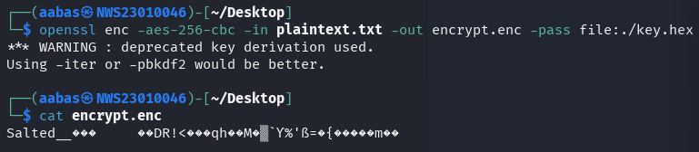

# 🔐 Lab 3: Hands-on Exploration of Cryptographic Tools (OpenSSL)

---

## 🧠 Lab Objectives

This lab introduces students to OpenSSL, a powerful open-source cryptographic toolkit. Students will explore core cryptographic operations including:

- Symmetric encryption (AES)
- Asymmetric encryption (RSA)
- Hashing (SHA-256)
- Digital signatures (RSA + SHA-256)

### Upon Completion, You Will Be Able To:

✅ Encrypt and decrypt files using symmetric and asymmetric methods  
✅ Generate and verify data hashes  
✅ Create and verify digital signatures

---

## 🧩 Lab Tasks

You are required to research and use correct `OpenSSL` commands to:

1. **Symmetric Encryption** – using AES
2. **Asymmetric Encryption** – using RSA keys
3. **Hashing** – using SHA-256
4. **Digital Signatures** – sign and verify using RSA + SHA-256

---

## Task 1 : Symmetric Encryption and Decryption using AES-256-CBC

### Tools Used :
- Openssl

### Step-by-step :

#### Step 1 :
Creat a simple `key` and some `plaintext` in file.

#### Key :
```bash
echo "hayabusa" > rsa_key.hex
```

#### Plaintext :
```bash
echo "can I borrow RM100?" > plaintext.txt
```

#### Step 2 :
Lets encrypt the plaintext using aes-cbc.

#### Commands :
```bash
openssl enc -aes-256-cbc -in plaintext.txt -out encrypt.enc -pass file:./rsa_key.hex
```



## 📌 Notes

This repository is part of my journey to mastering cryptography fundamentals using real tools like OpenSSL. It serves both as a study reference and demonstration of hands-on competency.

---

