# 🔐 Lab 3: Hands-on Exploration of Cryptographic Tools (OpenSSL)

Muhammad Aabas Bin Md Suji
-My partner is Ezekiel
---

## 🧠 Lab Objectives

This lab introduces students to OpenSSL, a powerful open-source cryptographic toolkit. Students will explore core cryptographic operations including:

- Symmetric encryption (AES)
- Asymmetric encryption (RSA)
- Hashing (SHA-256)
- Digital signatures (RSA + SHA-256)

### Upon Completion, You Will Be Able To:

✅ Encrypt and decrypt files using symmetric and asymmetric methods  
✅ Generate and verify data hashes  
✅ Create and verify digital signatures

---

## 🧩 Lab Tasks

You are required to research and use correct `OpenSSL` commands to:

1. **Symmetric Encryption** – using AES
2. **Asymmetric Encryption** – using RSA keys
3. **Hashing** – using SHA-256
4. **Digital Signatures** – sign and verify using RSA + SHA-256

---

## Task 1 : Symmetric Encryption and Decryption using AES-256-CBC

### Tools Used :
- Openssl

### Step-by-step :

#### Step 1 :
I am a `reciever` and `Kiel` is a `sender`. He will create a plaintext and key then send to me the encrypted message.

#### Plaintext :
```bash
echo "flag{AES_256_CBC}" > kiel_aes.txt
```


#### Cyphertext :
```bash
openssl enc -aes-256-cbc -salt -in kiel_aes.txt -out kiel_aes.enc -k abc123
```
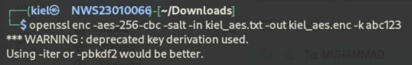

- `openssl` - Tells OpenSSL to use its encryption function
- `-aes-256-cbc` -Specifies the AES encryption algorithm with a 256-bit key in CBC (Cipher Block Chaining) mode.
- `-in` - Specifies the input file to be encrypted
- `-out` - Specifies the output file where the encrypted data will be stored
- `-k` - Uses the password `abc123` to generate the encryption key

Now Kiel will send the message and pub key to me.

---

#### Step 2 :
After I recieve the message and key from email, lets dencrypt the cyphertext using `abc123` as key.

#### Commands :
```bash
openssl enc -d -aes-256-cbc -in kiel_aes.enc -out kiel_aes.txt 
```
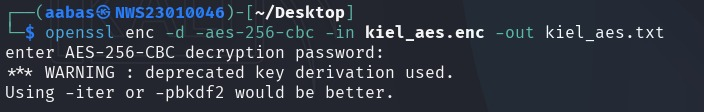

- `-d` - tells openssl to decrypt the cyphertext

#### Results :
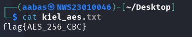

flag{AES_256_CBC}

---

## Task 2 : Asymmetric Encryption and Decryption using RSA

Here I am sender and Kiel as a reciever but Kiel to give he`s public key first.

---

### Step 1 :
Kiel need to generate pirvate and public key first then give me the public key.

#### Private key :
```bash
openssl genpkey -algorithem RSA -out private.pem -pkeyopt rsa_keygen_bits:2048
```


- `openssl genpkey`: Tells OpenSSL to generate a private key.
- `-algorithm RSA`: Specifies to use the RSA algorithm.
- `-out private.pem`: Saves the key into a file named `private.pem`.
- `-pkeyopt rsa_keygen_bits:2048`: Sets the key size to 2048 bits (a standard secure length).

#### Public key :
```bash
openssl rsa -in private.pem -pubout -out public.pem
```

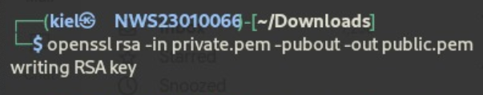

- `openssl rsa`: Uses the RSA tool.
- `-in private.pem`: Reads your private key file.
- `-pubout`: Tells OpenSSL to output the public key.
- `-out public.pem`: Saves the public key into `public.pem`.

---

### Step 2 :
Kiel will send the public key `public.pem` to me.

---

### Step 3 :

Now from the public key, I will encrypt a message using Kiel`s public key.

#### Command :
```bash
openssl rsautl -encrypt -inkey public.pem -pubin -in secret.txt -out aabas.enc 
```
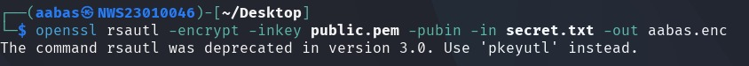

- `openssl rsautl`: Use OpenSSL's RSA utility tool.
- `-encrypt`: You're encrypting data.
- -inkey public.pem: Use the `public key` file called public.pem.
- `-pubin`: Tells OpenSSL that the key you're using is a public key.
- `-in secret.txt`: The input file (the message or secret) is `secret.txt`.
- `-out aabas.enc`: The output file, which will contain the encrypted version of the message, is named `aabas.enc`.


Now I will send the message back to Kiel.

---

### Step 4 :
Kiel will decrypt the message using his private key.

#### Command :
```bash
openssl rsautl -decrypt -inkey private.pem -in aabas.enc -out aabas.txt
```
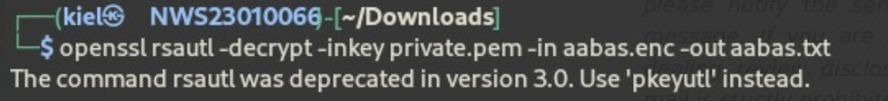

- `-decrypt` : tells openssl to decrypt.
- `-inkey` : private key that want to use.

#### Result :
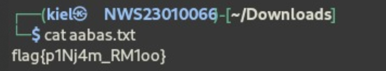

---

## Task 3 :Hashing and Message Integrity using SHA-256

For this task I'm do it personally.

---

### Step 1 :
Create a plaintext and hash it.

#### Command :
```bash
echo "Secure your password with hashing" > hash.txt
```


### Step 2 :
Hashing the hash usung SHA-256
```bash
openssl dgst -sha256 hash.txt
```
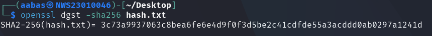

- `openssl dgst`: Use OpenSSL to compute a digest (hash).

- `-sha256`: Specify the SHA-256 algorithm.

### Step 3 :
Modify the file.

#### Command :
```bash
echo "-" >> hash.txt
```

### Step 4 :
Hashing the text again and compare with the previous hash

#### Command :
```bash
openssl dgst -sha256 hash.txt
```
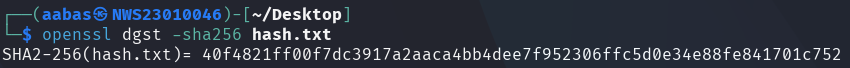

✅ You’ll see a completely different hash.

---

### 🧠 Explanation:

- SHA-256 creates a unique fingerprint of the file.
- Even small changes make a new hash (🔁 Avalanche Effect).
- Used to verify file integrity.

---

## Task 4 : Digital Signatures using RSA

Here Kiel will sign a file with digital signature using his private key.

---

### Step 1 :
generate digital signature using Kiel's private key.

```bash
openssl dgst -sha256 -sign private.pem -out sign_keil.bin ds_kiel.txt
```
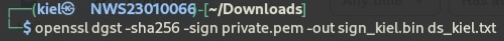

- openssl dgst: Use OpenSSL to perform a digest (hash) operation.

- -sign private.pem: Use the private key from private.pem to sign the hash.

- -out sign_keil.bin: Save the digital signature to sign_keil.bin.

- ds_kiel.txt: The original file whose contents are being signed.

Now Kiel will send a txt file and digital signature.

---

### Step 2 :

Let's verify the txt file using the digital signature.

#### Command :
```bash
openssl dgst -sha256 -verify public.pem -signature sign_kiel.bin ds_kiel.txt
```
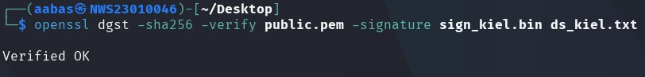

- `-verify` : tells openssl to verify using digital signature.

#### Result :
```ngix
Verified OK
```

## 📌 Notes

This repository is part of my journey to mastering cryptography fundamentals using real tools like OpenSSL. It serves both as a study reference and demonstration of hands-on competency.

---

