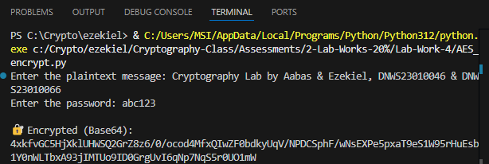
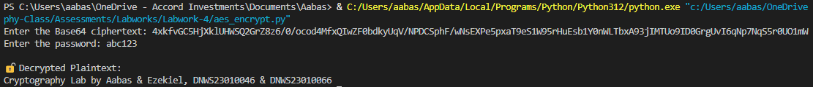
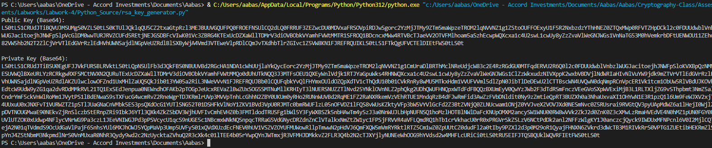
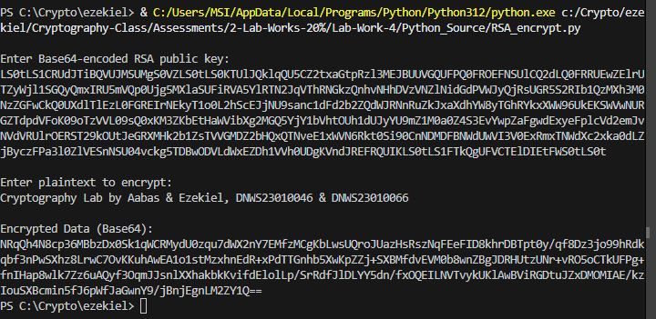
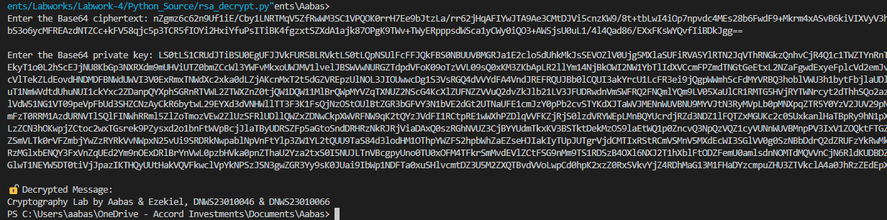
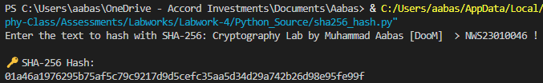
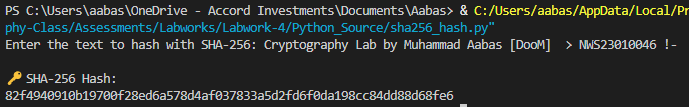
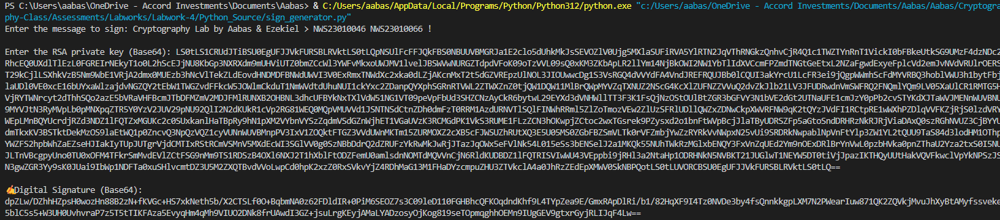
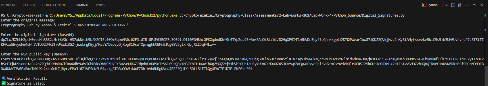
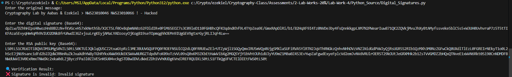

# 🔐 Lab 4: Implementing Cryptography with Python

**Name** : Muhammad Aabas Bin Md Suji     **My partner** : Ezekiel

---

## 🧠 Objectives

This lab covers:

- Symmetric Encryption using AES
- Asymmetric Encryption using RSA
- Hashing using SHA-256
- Digital Signatures using RSA

---

## 🔨 Tools
Here I'm using `Visual Studio Code` for my platform to run python code.

> How to use `VS Code`?

#### Step 1 :
install python from extensions

#### Step 2 :
Open terminal in vscode and install `pycryptodome`.

```bash
pip install pycryptodome
```

- If error, It will give the right command then use full quotes in PowerShell. Example :
```powershell
& "C:/Users/aabas/AppData/Local/Programs/Python/Python312/python.exe" -m pip install pycryptodome
```

Now our `visual studio code` is ready to use.

---
## 🧩 Tasks Overview

# ✅ Task 1: Symmetric Encryption (AES)

## 🔐 What is AES?

**AES (Advanced Encryption Standard)** is a symmetric encryption algorithm that securely encrypts and decrypts data using a **shared secret key**.

- The **same key** is used for both encryption and decryption.
- It’s widely used for securing files, communications, and data at rest.

---

## 🛠️ Python Code

- 📄 [`aes_encrypt.py`](Python_Source/aes_encrypt.py) – encrypts plaintext using AES  
- 📄 [`aes_dencrypt.py`](Python_Source/aes_dencrypt.py) – decrypts AES ciphertext back to plaintext  

---

## 🔐 Encrypt the Plaintext

**Ezekiel** encrypts a secret message using his own key and sends you the ciphertext.

📸 Screenshot:  


---

## 🔓 Decrypt the Ciphertext

You receive the encrypted message and use the same key to decrypt it and reveal the original message.

📸 Screenshot:  


---

## 💡 Explanation

- 🔑 `Generate a key` – A shared secret (like a password) to secure the data.
- 🔐 `Encrypt` – Converts your plaintext into unreadable ciphertext.
- 🔓 `Decrypt` – Converts the ciphertext back into the original readable message.

---

AES is fast, efficient, and ideal for when both sender and receiver can **securely share the same key**.

---

# ✅ Task 2: Asymmetric Encryption (RSA)

## 🔐 What is RSA?

**RSA** is an asymmetric encryption method that uses a pair of keys:

- 🔓 **Public key** – used to **encrypt** data  
- 🔐 **Private key** – used to **decrypt** data

This ensures that only the intended recipient (who holds the private key) can read the message.

---

## 🛠️ Python Code

- 📄 [`rsa_key_generator.py`](Python_Source/rsa_key_generator.py) – generates RSA key pairs  
- 📄 [`rsa_encrypt.py`](Python_Source/rsa_encrypt.py) – encrypts plaintext using the public key  
- 📄 [`rsa_decrypt.py`](Python_Source/rsa_decrypt.py) – decrypts ciphertext using the private key  

---

## 🔑 Generate Key Pairs

Create an RSA key pair:

- **Private Key** → keep secret  
- **Public Key** → share with others (e.g. Kiel)

📸 Screenshot:  


---

## 🔐 Encrypt the Plaintext

**Kiel** uses your **public key** to encrypt a message into ciphertext and sends it back to you.

📸 Screenshot:  


---

## 🔓 Decrypt the Ciphertext

You use your **private key** to decrypt the ciphertext back to the original plaintext.

📸 Screenshot:  


---

## 💡 Explanation

- 🔑 `Generate key pair` → Produces a secure private/public key pair  
- 📥 `Encrypt with public key` → Only the private key can decrypt the result  
- 📤 `Decrypt with private key` → Recovers the original message  

---

RSA ensures that **only the intended receiver** can read a message, and it's a foundational concept in secure communications.

---

# ✅ Task 3: Hashing (SHA-256)

## 🔐 What is SHA-256?

**SHA-256** is a cryptographic hash function that transforms input data into a fixed-size string (called a *digest*).  
It is a **one-way function**, meaning the original message cannot be retrieved from the hash.  
It's used for **verifying data integrity**, not for encryption or decryption.

---

## 🛠️ Python Code

- 📄 [`sha256_hash.py`](Python_Source/sha256_hash.py) – generates SHA-256 hashes from text input

---

## 🧪 Hashing a Message

📸 Screenshot:  
Hashing the original message:



---

## ✏️ Modifying the Message

Even a small change (adding a `-` at the end) completely changes the hash output.

📸 Screenshot:  


---

## 🧾 Hash Results

### ✅ Original Message:
> `Cryptography Lab by Muhammad Aabas [DooM]  > NWS23010046 !`

```bash
01a46a1976295b75af5c79c9217d9d5cefc35aa5d34d29a742b26d98e95fe99f
```

### ❌ Modified Message:
> `Cryptography Lab by Muhammad Aabas [DooM]  > NWS23010046 !-`

```bash
82f4940910b19700f28ed6a578d4af037833a5d2fd6f0da198cc84dd88d68fe6
```

### 🌪️ What is the Avalanche Effect?
When you change even 1 character (or 1 bit) in the input, the entire hash output changes drastically — like a chain reaction.

### 🔍 Why Does It Happen?

Hash functions are designed so that:

- Tiny changes in input produce completely different hashes
- You can’t guess the input from the hash
- It’s impossible to predict how the output will change

This makes hash functions very secure and perfect for:

- `Password storage`
- `File integrity checking`
- `Digital signatures`

---

# 🔐 Task 4: Digital Signatures (RSA)

## ✍️ What is a Digital Signature?

A digital signature guarantees:

- ✅ **Integrity** – The message was not altered.
- ✅ **Authenticity** – The message truly came from the private key owner.

### 🧠 How It Works:

1. The sender **signs** the message using their `private key`.
2. The receiver **verifies** the signature using the sender's `public key`.

---

## 🛠️ Python Code

- 📄 [`sign_generator.py`](Python_Source/sign_generator.py) – generates the digital signature  
- 📄 [`sign_verify.py`](Python_Source/sign_verify.py) – verifies the digital signature

---

## ✉️ Steps

### 1️⃣ Generate & Sign Message

Use your `private key` (from **Task 2**) to sign a message and send both the message and the signature to **Kiel**.

📸 Screenshot:  


---

### 2️⃣ Verify the Message

**Kiel** uses your `public key` to verify that the message and signature are valid and unchanged.

📸 Screenshot:  


---

### 3️⃣ Modify the Message

If even a small change is made to the message, verification will fail — demonstrating tamper detection.

📸 Screenshot:  


---

## ✅ Summary

🔒 Digital signatures are strict by design:

- The message, key, padding, and hash **must match exactly**.
- Even the slightest change causes `.verify()` to fail.
- This behavior ensures strong protection against tampering or corruption.

---

## 💡 Function Breakdown

- 🔐 `private_key.sign()` → Signs the message (only the private key holder can do this).
- 🔓 `public_key.verify()` → Confirms the message hasn't been altered and matches the original signature.


---

```bash
If you have question, you can contact me 😉
```