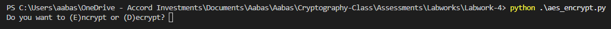

# 🔐 Lab 4: Implementing Cryptography with Python

**Name** : Muhammad Aabas Bin Md Suji     **My partner** : Ezekiel

---

## 🧠 Objectives

This lab covers:

- Symmetric Encryption using AES
- Asymmetric Encryption using RSA
- Hashing using SHA-256
- Digital Signatures using RSA

---

## 🔨 Tools
Here I'm using `Visual Studio Code` for my platform to run python code.

> How to use `VS Code`?

#### Step 1 :
install python from extensions

#### Step 2 :
Open terminal in vscode and install `pycryptodome`.

```bash
pip install pycryptodome
```

- If error, It will give the right command then use full quotes in PowerShell. Example :
```powershell
& "C:/Users/aabas/AppData/Local/Programs/Python/Python312/python.exe" -m pip install pycryptodome
```

Now our `visual studio code` is ready to use.

---
## 🧩 Tasks Overview

### ✅ Task 1: Symmetric Encryption (AES)

- Here is my [AES_python](aes_encrypt.py) code.

#### Run python code :
After run the code, we can choose whether we want to encrypt/decrypt a message.


#### Encrypt the plaintext :
Choose `E` to encrypt the message then drop our plaintext.


---

### ✅ Task 2: Asymmetric Encryption (RSA)

- Generate RSA key pair.
- Encrypt with public key, decrypt with private key.
- 🔗 [View Code](task2_rsa/rsa_encryption.py)
- 🖼️ Output: `sample_output.png`

---

### ✅ Task 3: Hashing (SHA-256)

- Generate SHA-256 hash of input strings and files.
- Multiple inputs shown.
- 🔗 [View Code](task3_hashing/sha256_hashing.py)
- 🖼️ Screenshots: [hashing_screenshots](task3_hashing/hashing_screenshots/)

---

### ✅ Task 4: Digital Signatures (RSA)

- Message signing using private key.
- Signature verification using public key.
- 🔗 [View Code](task4_digital_signature/digital_signature.py)
- 🖼️ Output: `signature_verification.png`

---

